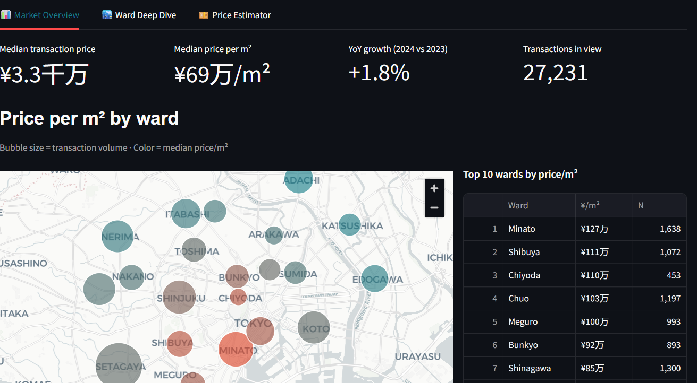

# 🗼 Tokyo Real Estate Explorer

An interactive Streamlit dashboard for exploring Tokyo's 23 Special Wards (特別区) real estate market — prices, trends, ward-level breakdowns, and a price estimator.

**Live demo:** https://tokyo-real-estate-explorer-santiagomuru.streamlit.app
**Portfolio:** https://santimuru.github.io



---

## Features

- **Market Overview** — Interactive Pydeck map of the 23 wards with median price/m², KPI cards (median price, ¥/m², YoY growth), price trend line, and property-type composition.
- **Ward Deep Dive** — Drill into any ward: price distribution, area-vs-price scatter by property type, temporal trend, and top stations leaderboard.
- **Price Estimator** — Enter ward, area, year built, and station distance to get a P10/P50/P90 price range based on comparable transactions (k-NN heuristic).
- **Global filters** — Year range, property type, and area sliders applied across every tab.

---

## Data

This project is designed to run against the **MLIT Real Estate Information Library** (国土交通省 不動産情報ライブラリ), Japan's official public API for real estate transaction data.

Two backends are supported via the `DATA_SOURCE` environment variable:

| Backend | Description |
|---|---|
| `synthetic` *(default)* | Deterministic, statistically realistic dataset (~50k transactions) modeled after MLIT public aggregates. Used while MLIT API key approval is pending. |
| `mlit_api` | Live calls to the MLIT Reinfolib API (`XIT001` endpoint). Requires a free subscription key — see `utils/data_loader.py`. |

Switching backends is a one-line change; the DataFrame schema is shared.

---

## Tech stack

- **Streamlit** — dashboard framework
- **Pandas / NumPy** — data wrangling
- **Plotly** — charts (histograms, lines, scatter, bars)
- **Pydeck** — interactive 3D map
- **Python 3.11+**

---

## Run locally

```bash
git clone https://github.com/santimuru/tokyo-real-estate-explorer.git
cd tokyo-real-estate-explorer
pip install -r requirements.txt
streamlit run app.py
```

Then open http://localhost:8501

To use the real MLIT API (once you have a key):

```bash
export DATA_SOURCE=mlit_api
export MLIT_API_KEY=your_subscription_key_here
streamlit run app.py
```

---

## Project structure

```
tokyo-real-estate-explorer/
├── app.py                    # Streamlit main
├── utils/
│   ├── data_loader.py        # synthetic + MLIT API backends
│   ├── ward_data.py          # ward metadata (coords, stats, stations)
│   └── analytics.py          # aggregations + price estimator
├── assets/
│   └── screenshot.png
├── requirements.txt
└── README.md
```

---

## Author

**Santiago Martinez** — Data Analyst based in Tokyo
- Portfolio: https://santimuru.github.io
- LinkedIn: https://www.linkedin.com/in/santiago-martinez-pezzatti-4241a3165/
- GitHub: https://github.com/santimuru

---

## License

MIT
